# Detailed Walkthrough – Wazuh SIEM File Integrity Monitoring Lab

## 1. Network Configuration

Ubuntu VM and Windows machine were configured on the same network using bridged mode.

### Ubuntu IP
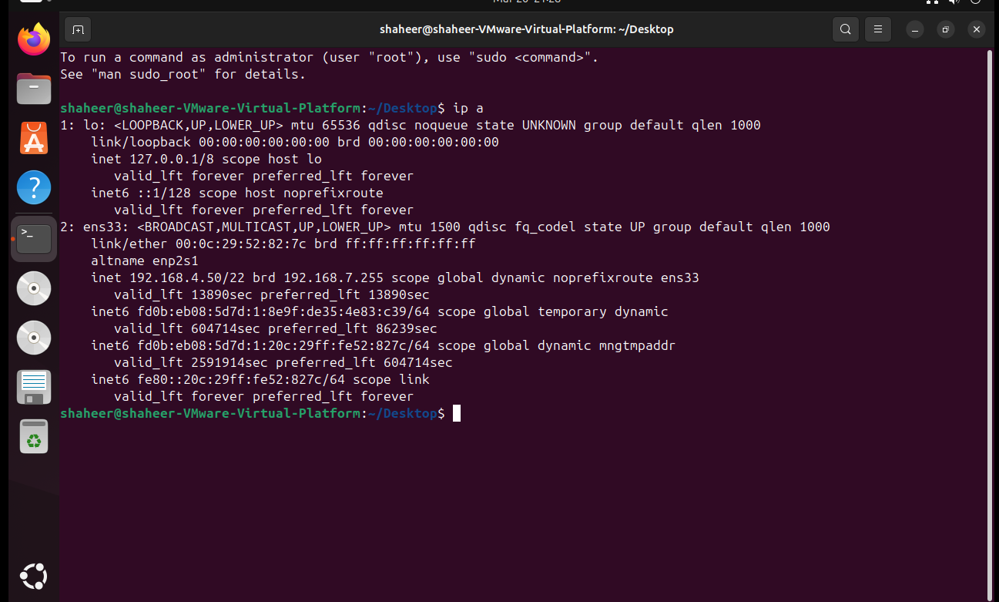

### Windows IP
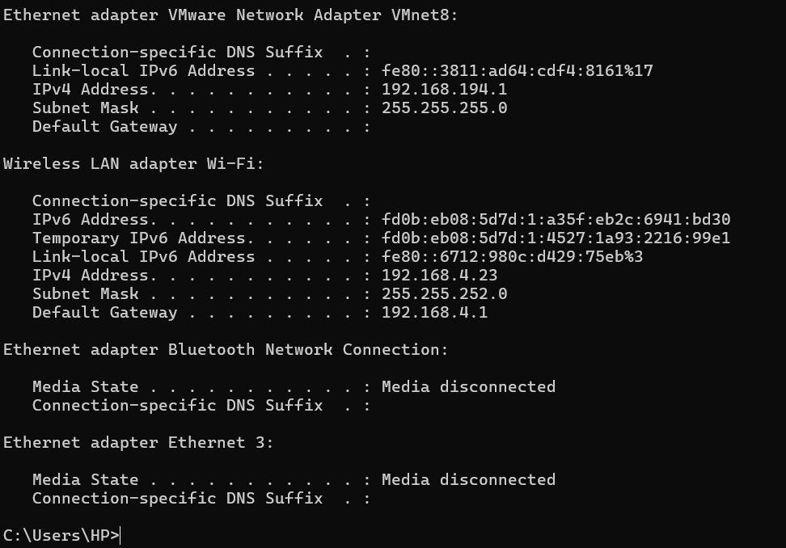

---

## 2. Wazuh Manager Installation

Wazuh was installed on the Ubuntu VM using the official installation script.

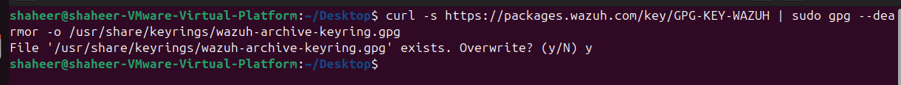

---

## 3. Accessing the Dashboard

After installation, the Wazuh dashboard was accessed via browser.

### Login Page
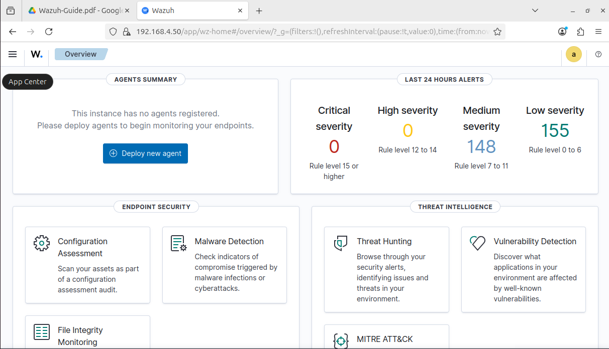

### Dashboard Overview
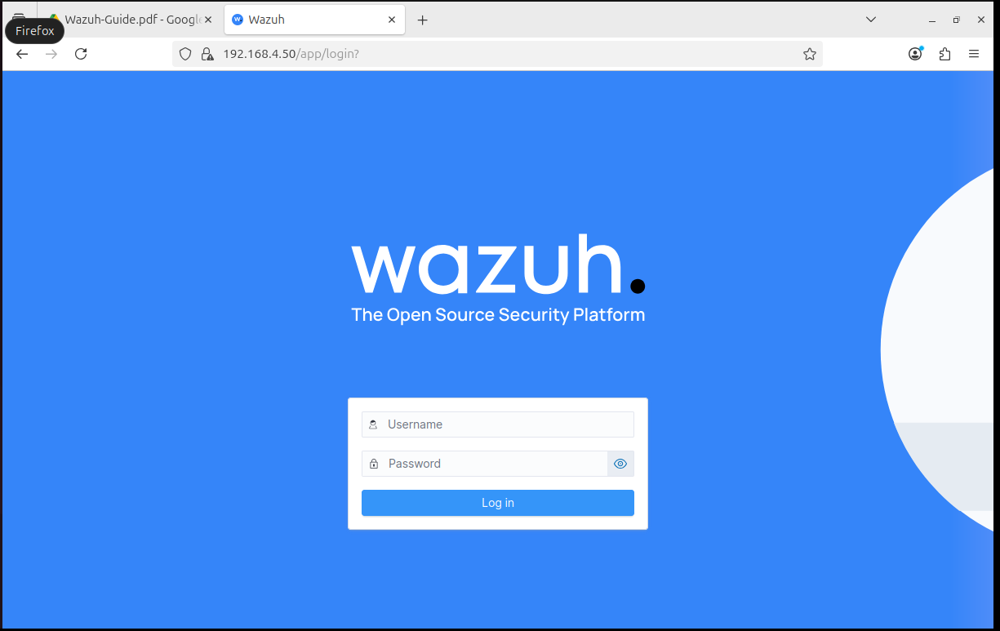

---

## 4. Agent Setup (Windows)

The Wazuh agent was installed and configured on the Windows machine.

### Agent Configuration
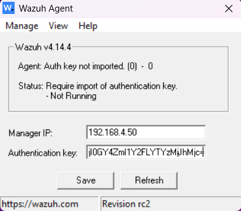

---

## 5. Agent Registration

Agent was registered using the manager.

### Manage Agents
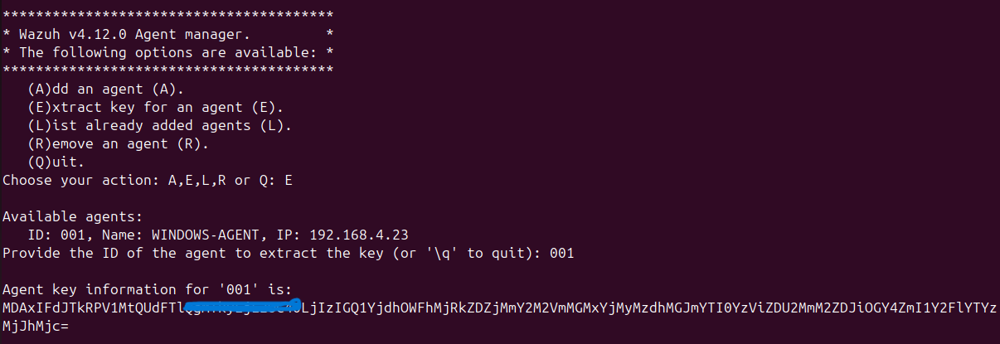

### Extracted Key
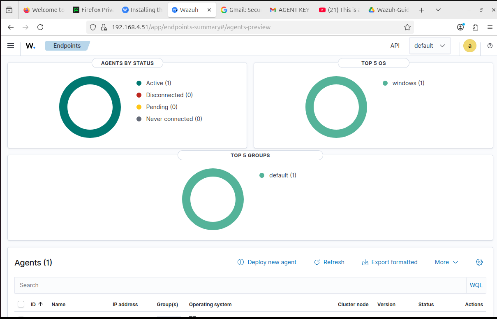

---

## 6. Agent Connected

After configuration, the agent successfully connected and appeared as active.

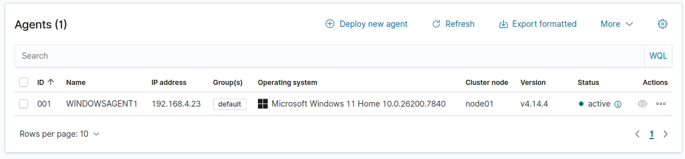

---

## 7. File Integrity Monitoring Configuration

File Integrity Monitoring (FIM) was enabled by editing the configuration file.

### Windows Configuration File
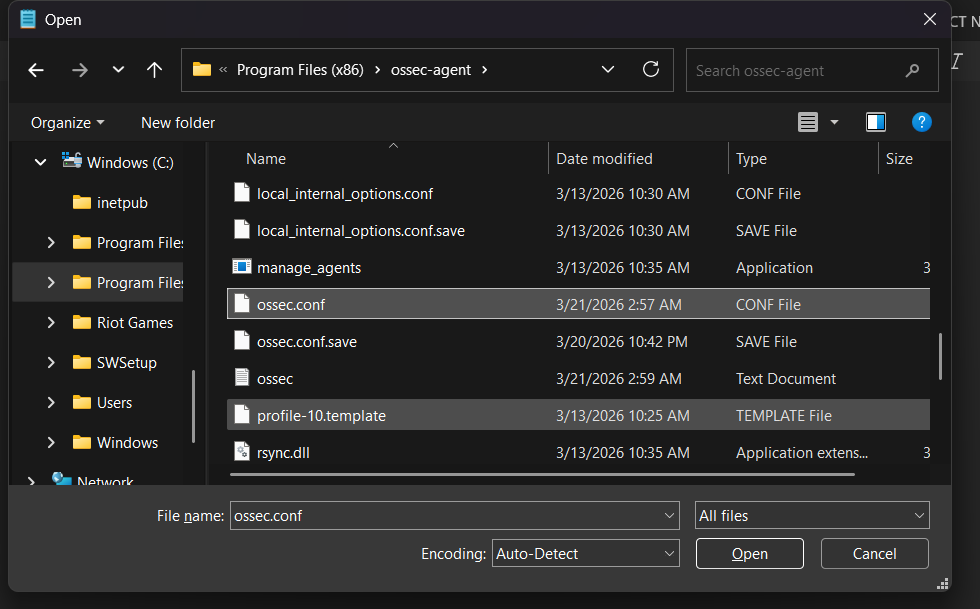

### FIM Directory Added
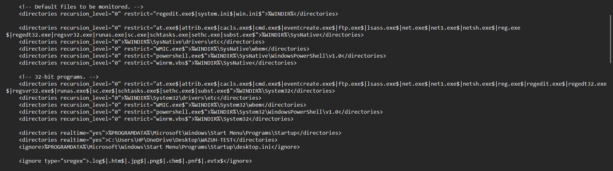

---

## 8. Test Scenario

A test file was created in the monitored directory to trigger alerts.

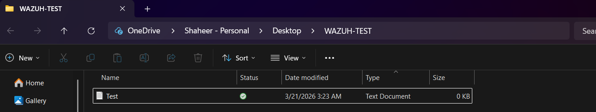

---

## 9. File Integrity Monitoring Events

Wazuh detected file creation, deletion, and modification events in real time.

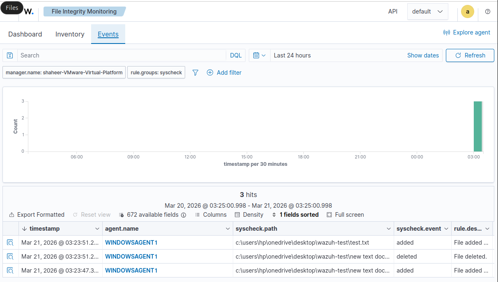

---

## 10. Log Analysis

Detailed logs were analyzed, including rule ID, hashes, and metadata.

### Log Details 1
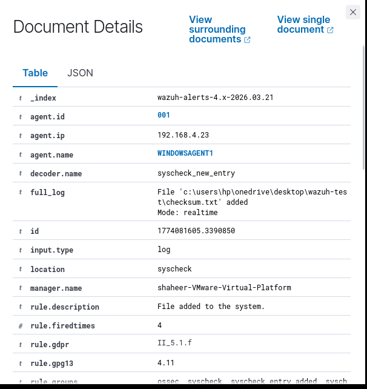

### Log Details 2
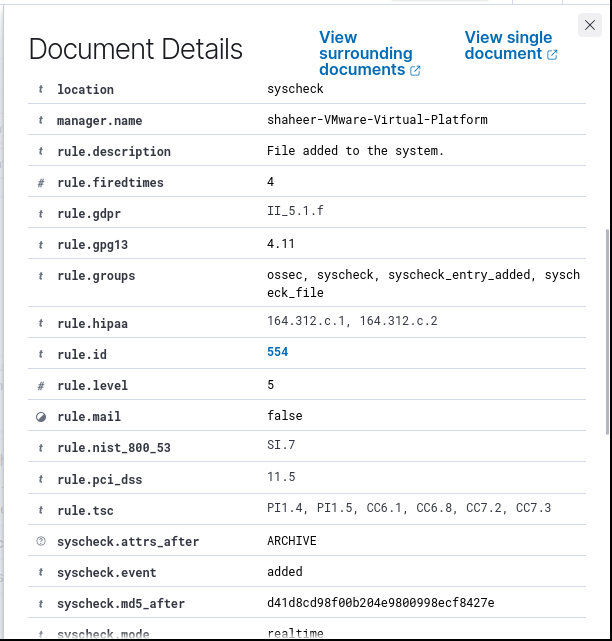

### Log Details 3
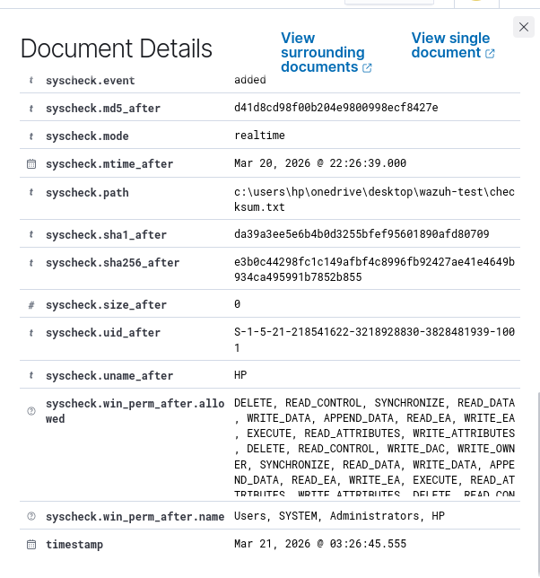

---

## 11. Troubleshooting

During setup, an issue with incompatible agent version was encountered and resolved.

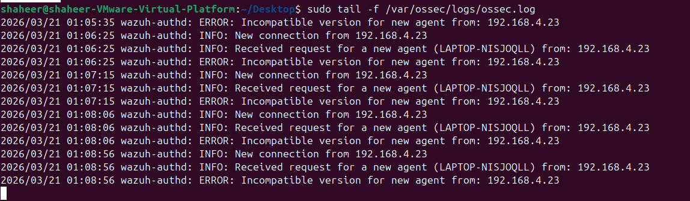

---

## Summary

- Successfully deployed Wazuh SIEM lab
- Connected Windows agent to Ubuntu manager
- Enabled File Integrity Monitoring (FIM)
- Detected file changes in real time
- Analyzed logs including hashes and rule IDs
- Resolved setup and compatibility issues
